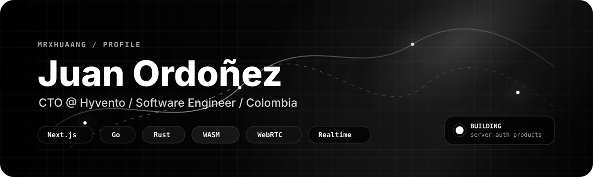
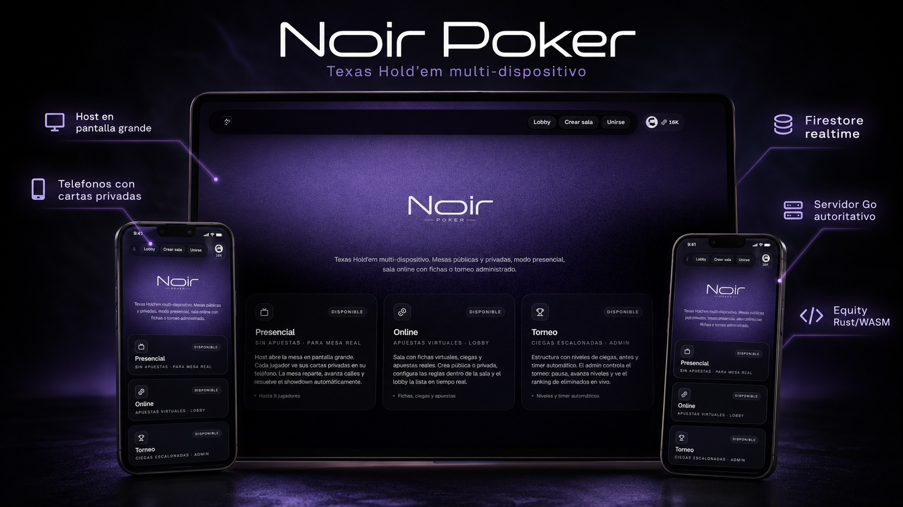

 

 

| Systems | Leadership | Builder |
| --- | --- | --- |
| **End-to-end systems** Desde el pixel hasta el servidor autoritativo. Construyo productos donde la interfaz, el runtime y la infraestructura hablan el mismo idioma. | **CTO @ Hyvento** Dise&ntilde;o arquitectura, tomo decisiones de fondo y convierto ideas en sistemas mantenibles, medibles y reales. | **Software engineer** Enfocado en producto, sistemas realtime y arquitectura web moderna con criterio de performance, escalabilidad y experiencia de usuario. |

 

## Stack, por capas

**Product / UI**

**Runtime**

**Backend / Data / Infra**

`WebSockets` &nbsp; `WebRTC` &nbsp; `WebAssembly` &nbsp; `SEO/GEO` &nbsp; `server-authoritative loops`

 

## Proyecto destacado

  

**Noir - Poker Platform**  
Texas Hold'em multi-dispositivo para mesas presenciales, partidas online y torneos administrados.

Plataforma multi-jugador trustless, real-time y dise&ntilde;ada alrededor de una regla simple: el cliente nunca decide lo que el servidor debe validar.

- **Go server:** loop autoritativo sobre WebSockets. El servidor reparte, valida y env&iacute;a hoyos privados por asiento. 0 cross-leaks probados.
- **Rust -> WASM:** evaluador de 7 cartas compilado a WebAssembly. Enumeraci&oacute;n exacta en flop/turn/river y MC 30k trials preflop. Sin round-trips al servidor.
- **Econom&iacute;a server-auth:** wallet v&iacute;a Firebase Admin SDK en Route Handler. Clientes no mienten sobre coins ni XP.
- **Voz P2P:** WebRTC full-mesh, Opus 24 kbps v&iacute;a SDP munging y TURN fallback. Aguanta 10 peers en redes m&oacute;viles.

[Ver repositorio](https://github.com/MrxHuaang/Noir-Poker)

 

## Forma de trabajar

| 01 | 02 | 03 | 04 |
| --- | --- | --- | --- |
| **Primero el modelo** Reglas, datos y permisos antes de pintar pantallas. | **UI con criterio** Interfaces limpias, r&aacute;pidas y construidas para uso real. | **Realtime sin humo** Estado sincronizado, latencia asumida y autoridad clara. | **Producto medible** Performance, SEO/GEO y arquitectura pensada para crecer. |

 

## Actividad

  

 

  

