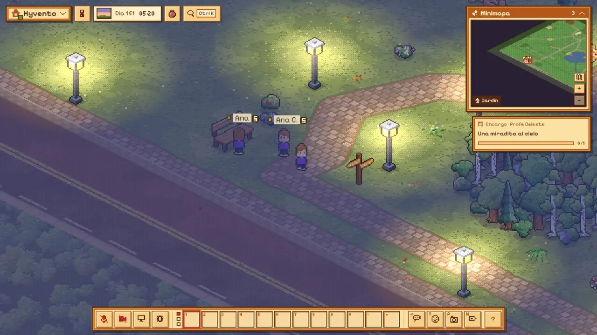
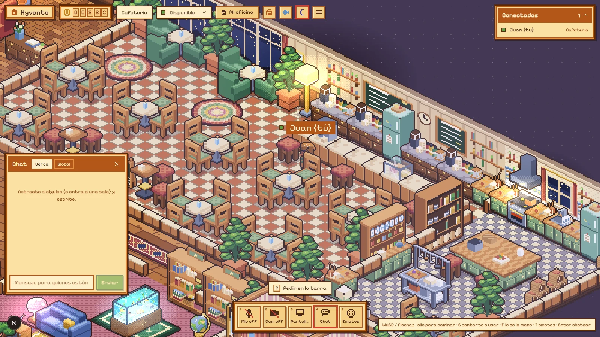
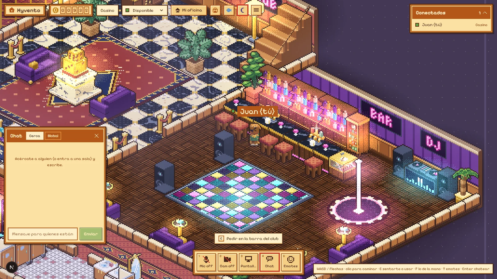
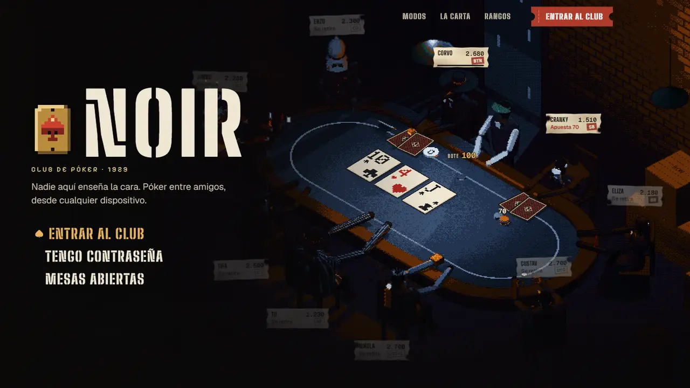
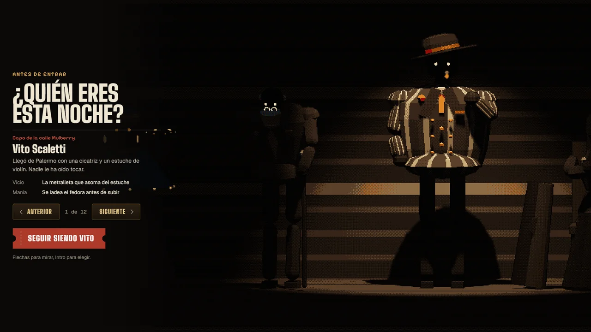
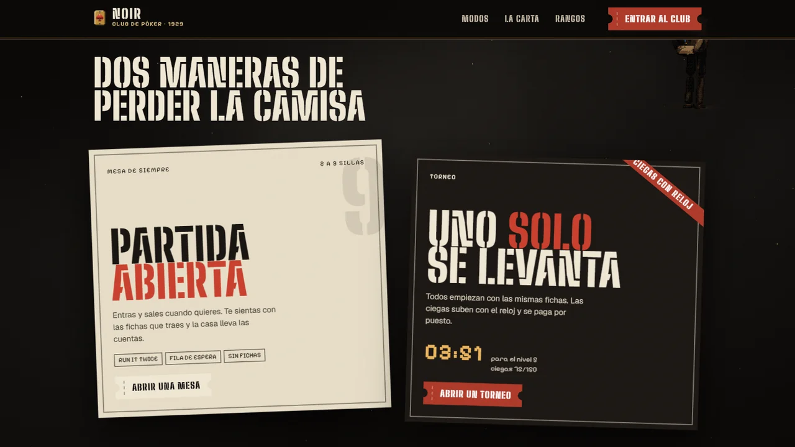

 

   

 

## ✦ Proyectos destacados

<table>
  <tr>
    <td width="33%"></td>
    <td width="33%"></td>
    <td width="33%"></td>
  </tr>
</table>

### Lumbre · la cabaña virtual de tu equipo

Oficina virtual isométrica en pixel-art: caminas por una cabaña, te acercas a alguien y empiezas a hablar. Cada persona tiene su chibi, su oficina y un PC con su propio sistema operativo.

- **Servidor autoritativo (Colyseus):** el cliente anticipa, el servidor decide. Movimiento, paredes, asientos, portales y oficinas cerradas se validan con el mismo mundo y el mismo A* que usa el navegador.
- **Voz y video por proximidad (LiveKit):** suscripción selectiva en el SFU. Solo recibes las pistas de quien tienes cerca, y una sala cerrada aísla el audio.
- **Arte 100% procedural:** motor pixel propio con cajas isométricas, sombreado por cara, luces de noche y letreros de neón letra por letra. Cero assets dibujados a mano.
- **Economía con libro contable:** puntos por presencia y reuniones, tienda, cafetería y un casino con azar criptográfico y límite diario, todo en transacciones Postgres.

[**Ver repositorio →**](https://github.com/MrxHuaang/lumbre)

 

<table>
  <tr>
    <td width="50%"></td>
    <td width="50%"></td>
  </tr>
</table>

### Noir Poker · club de póker, 1929

Texas Hold'em entre amigos, cada uno desde su teléfono o computador, en una sala de juego clandestina en pixel art 3D. La información vive en el mundo y no en paneles: las sillas son cartas con agujeros de bala, el bote va escrito con tiza sobre el paño y el reloj del turno es un cigarro en el cenicero.

- **Backend autoritativo serverless:** cada jugada es un `POST` que corre una transacción de Firestore. El mazo vive en el servidor y cada jugador lee solo sus cartas. Sin servidor aparte que mantener encendido.
- **Motor de juego puro en TypeScript:** apuestas, side pots, run it twice, straddle, bomb pots y torneos con ciegas por niveles. Probado con fuzz de conservación de fichas.
- **Escena three.js:** mesa, puerta y 12 personajes en pixel art 3D, alimentada por snapshots del estado; anima solo la diferencia entre manos.
- **Voz P2P en la mesa:** WebRTC entre teléfonos con señalización por Supabase Realtime y TURN opcional.

[**Ver repositorio →**](https://github.com/MrxHuaang/Noir-Poker)

 

## ✦ También construí

<table>
  <tr>
    <td width="33%" valign="top">
      <b>Zephr</b> 
      Búsqueda y seguimiento de Airworthiness Directives de 7 autoridades de aviación civil en un solo espacio de trabajo. Next.js, Supabase con RLS, Stripe y scrapers en Python.
    </td>
    <td width="33%" valign="top">
      <b><a href="https://github.com/MrxHuaang/sortea-">Sortea</a></b> 
      Plataforma de rifas: venta de números, control de compradores y el ganador revelado en vivo.
    </td>
    <td width="33%" valign="top">
      <b><a href="https://github.com/MrxHuaang/LinternaAnuncios">Linterna</a></b> 
      Clicker incremental: toca, gana monedas y mejora la linterna.
    </td>
  </tr>
</table>

 

## ✦ Stack, por capas

<code>PRODUCTO / UI</code> 

<code>RUNTIME</code> 

<code>BACKEND · DATOS · INFRA</code> 

<code>WebSockets</code> · <code>WebRTC</code> · <code>WebAssembly</code> · <code>servidores autoritativos</code> · <code>SEO/GEO</code>

 

## ✦ Forma de trabajar

| 01 | 02 | 03 | 04 |
| --- | --- | --- | --- |
| **Primero el modelo** Reglas, datos y permisos antes de pintar pantallas. | **UI con criterio** Interfaces rápidas, construidas para uso real. | **Realtime sin humo** Estado sincronizado, latencia asumida y autoridad clara. | **Producto medible** Performance, SEO/GEO y arquitectura que aguanta crecer. |

 

## ✦ Actividad

 

